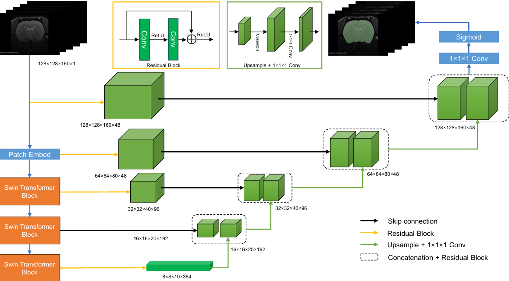

# Model Overview

This repository contains the RSS-Net framework for the task of rodent MRI skull stripping

# Installing Dependencies

Our framework is developed based on Python 3.9, [PyTorch 2.0.0](https://pytorch.org/), [MONAI](https://monai.io/), and [nnUNet](https://github.com/MIC-DKFZ/nnUNet). 

Dependencies can be installed using:

``` bash
conda create -n rss python=3.9

conda activate rss

# CUDA 11.7
conda install pytorch==2.0.0 torchvision==0.15.0 torchaudio==2.0.0 pytorch-cuda=11.7 -c pytorch -c nvidia
# CUDA 11.8
conda install pytorch==2.0.0 torchvision==0.15.0 torchaudio==2.0.0 pytorch-cuda=11.8 -c pytorch -c nvidia
# CPU Only
conda install pytorch==2.0.0 torchvision==0.15.0 torchaudio==2.0.0 cpuonly -c pytorch

pip install -r requirements.txt

python setup.py install
```


# Model

Our network architecture is illustrated in the following diagram:




# Data Description

We trained the model using MRI data from rodent brains collected from 89 centers. You can download the pre-trained model files and the annotated brain masks [Google Drive](https://drive.google.com/drive/folders/1cTlFFGL9iTUoZOT5Rgqi2ZAyqyPlXYd-) or [MEGA](https://mega.nz/folder/q8tgWZbQ#QWvYSDmONS-KWxs5k5ax9Q).

You can find the download links for these datasets in our article (***in submission***)

| Dataset           |          | MultiRat | StdRat | C Rat | TRat  | C Mouse | NeAt        |
|-------------------|----------|----------|--------|-------|-------|---------|-------------|
| Participant       |          | 646      | 209    | 132   | 24    | 16      | 10          |
| Image             |          | 751      | 209    | 132   | 24    | 16      | 10          |
| Sex               | Male     | 505      | 116    | 132   |       | 16      | 10          |
|                   | Female   | 141      | 93     |       | 24    |         |             |
| Strain            | Wistar   | 256      | 189    | 16    | 24    |         |             |
|                   | SD       | 220      |        | 94    |       |         |             |
|                   | LE       | 80       | 10     | 22    |       |         |             |
|                   | F344     | 60       | 10     |       |       |         |             |
|                   | LH       | 30       |        |       |       |         |             |
|                   | WTC      |          |        |       |       | 16      |             |
|                   | IC       |          |        |       |       |         | 10          |
| Age(months)       | 0-2      | 164      | 88     |       |       |         |             |
|                   | 2-4      | 308      | 57     |       |       |         | 12-14 weeks |
|                   | 4-6      | 16       | 2      |       |       |         |             |
|                   | 6-12     | 22       | 2      |       |       |         |             |
|                   | 12-20    | 28       |        |       |       |         |             |
|                   | -        | 108      | 60     | adult | adult | adult   |             |
| Weight(grams)     | 100-200  | 71       | 20     |       |       |         |             |
|                   | 200-250  | 78       | 71     |       |       |         |             |
|                   | 250-300  | 97       | 56     |       |       |         |             |
|                   | 300-350  | 173      | 40     |       |       |         |             |
|                   | 350-400  | 81       | 13     |       |       |         |             |
|                   | 400-700  | 94       | 9      |       |       |         |             |
|                   | -        | 52       |        | 132   |       | 16      | 25-30 grams |
| Vendor            | Bruker   | 568      | 180    | 132   | 24    | 16      | 10          |
|                   | MS       | 10       |        |       |       |         |             |
|                   | SD       | 68       |        |       |       |         |             |
|                   | A/B      |          | 10     |       |       |         |             |
|                   | Varian   |          | 10     |       |       |         |             |
|                   | Clinscan |          | 9      |       |       |         |             |
| Field Strength(T) | 3        | 10       |        |       |       |         |             |
|                   | 4.7      | 40       | 10     |       |       |         |             |
|                   | 7        | 309      | 79     |       |       |         |             |
|                   | 9.4      | 229      | 100    | 132   | 24    | 16      | 10          |
|                   | 11.7     | 30       |        |       |       |         |             |
|                   | 14       |          | 10     |       |       |         |             |
|                   | 14.1     | 28       |        |       |       |         |             |
|                   | 17.2     |          | 10     |       |       |         |             |


# Usage

After the installation is complete, you can use the following command to run the framework:

```bash
 RS2_predict -i 'path/to/input' -o 'path/to/output' -m 'path/to/pretrained_model.pt'
```

We recommend using absolute paths to avoid unnecessary problem.

To meet the required naming format, ensure that your input files are organized as follows:
```bash
|input_folder_path
|---- <file-name1>_0000.nii.gz
|---- <file-name2>_0000.nii.gz
```

# Comand Parameters
Here are the parameters for the RS2_predict script in Markdown format:

- **-i**: Input folder. Ensure that the files are in the .nii.gz format and end with _0000.nii.gz.
  
- **-o**: Output folder. If it does not exist, it will be created. Predicted segmentations will have the same name as their source images.

- **-m**: Path of the pretrained model you want to use. Default: RS2_pretrained_model.pt.


- **-device**: Use this to set the device the inference should run with. Available options are 'cuda' (GPU), 'cpu' (CPU), and 'mps' (Apple M1/M2). Do NOT use this to set which GPU ID! Use CUDA_VISIBLE_DEVICES=X RS2_predict [...] instead.

- **-step_size**: Step size for sliding window prediction. The larger it is, the faster but less accurate the prediction. Default: 0.5. Cannot be larger than 1. We recommend the default.

- **--disable_tta**: Set this flag to disable test time data augmentation in the form of mirroring. Faster, but less accurate inference. Not recommended.

- **--verbose**: Set this if you like being talked to. You will have to be a good listener/reader.

- **--save_probabilities**: Set this to export predicted class "probabilities". Required if you want to ensemble multiple configurations.

- **--continue_prediction**: Continue an aborted previous prediction (will not overwrite existing files).

- **-npp**: Number of processes used for preprocessing. More is not always better. Beware of out-of-RAM issues. Default: 3.

- **-nps**: Number of processes used for segmentation export. More is not always better. Beware of out-of-RAM issues. Default: 3.


# Citation
If you find this repository useful, please consider citing our paper:

```
Will be updated after the publication of the paper.
```
